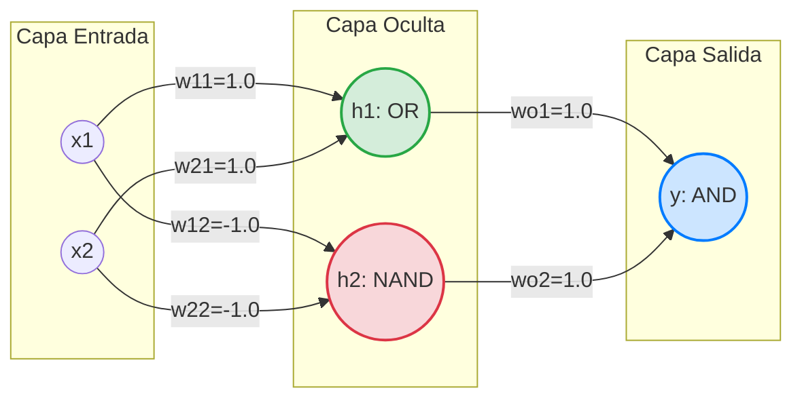

# UCV-SI-lab12: Perceptrón Simple y Análisis del Problema XOR

Este repositorio contiene una implementación en Python del algoritmo del **Perceptrón Simple**, un conjunto de datos linealmente separable de entrenamiento, un script de ejecución y un conjunto de pruebas automatizadas con cobertura de código.

---

## 📂 Estructura del Proyecto

*   [main.py](file:///c:/Users/User/Repositorios/UCV-SI-lab12/main.py): Script ejecutable de entrada que inicializa, entrena y prueba el perceptrón.
*   [src/perceptron.py](file:///c:/Users/User/Repositorios/UCV-SI-lab12/src/perceptron.py): Clase principal `Perceptron` con métodos para predicción (`predict`), entrenamiento (`train`) y la función de activación de escalón.
*   [src/dataset.py](file:///c:/Users/User/Repositorios/UCV-SI-lab12/src/dataset.py): Dataset de entrenamiento compuesto por ejemplos bidimensionales estructurados en tuplas `(inputs, label)`.
*   [tests/test_perceptron.py](file:///c:/Users/User/Repositorios/UCV-SI-lab12/tests/test_perceptron.py): Pruebas automatizadas escritas en `pytest` para verificar la precisión del perceptrón.
*   [requeriments.txt](file:///c:/Users/User/Repositorios/UCV-SI-lab12/requeriments.txt): Archivo de requerimientos del proyecto (dependencias como `pytest` y `pytest-cov`).

---

## 🚀 Instalación y Ejecución

### 1. Requisitos Previos
Se recomienda utilizar un entorno virtual de Python. Puedes crearlo y activarlo con:
```bash
python -m venv .venv
# En Windows:
.venv\Scripts\activate
# En Linux/macOS:
source .venv/bin/activate
```

### 2. Instalar Dependencias
Instala los paquetes necesarios definidos en `requeriments.txt`:
```bash
pip install -r requeriments.txt
```

### 3. Ejecutar el Proyecto
Para entrenar el perceptrón y realizar una predicción de prueba sobre el dato `[9, 1]`:
```bash
python main.py
```

### 4. Ejecutar Pruebas y Cobertura
Para ejecutar las pruebas automatizadas:
```bash
pytest
```
Para ver un informe de cobertura de código (coverage report):
```bash
pytest --cov=src tests/
```

---

## 📝 Preguntas de Análisis

### 1. ¿Qué representan los pesos?
Los **pesos ($w_i$)** representan la fuerza de conexión o importancia que tiene cada una de las variables de entrada ($x_i$) en la decisión final del perceptrón. 
*   Un peso **positivo y alto** indica que la característica correspondiente favorece fuertemente a que la salida sea activa ($1$).
*   Un peso **negativo** reduce la probabilidad de activación, actuando como un inhibidor.
*   Un peso **cercano a cero** significa que la entrada correspondiente tiene poca o nula relevancia en la predicción.

Durante el entrenamiento, el perceptrón ajusta iterativamente estos pesos para aprender cuáles características de entrada son determinantes y en qué dirección.

### 2. ¿Qué función cumple el bias?
El **bias ($b$)** o sesgo representa el umbral de activación del perceptrón y actúa como un peso asociado a una entrada constante igual a $1$. 
*   **Ajuste de umbral**: Controla qué tan fácil o difícil es que la neurona se active (es decir, que la suma ponderada supere el umbral).
*   **Desplazamiento geométrico**: En términos geométricos, el bias permite que el hiperplano de decisión (la frontera que separa las clases) se desplace fuera del origen de coordenadas. Sin un término de bias, la frontera de decisión siempre estaría obligada a pasar exactamente por el punto $(0, 0, \dots, 0)$, limitando severamente la capacidad del modelo para ajustarse a la distribución de los datos.

### 3. ¿Cómo aprende el perceptrón?
El perceptrón aprende a través de una regla de aprendizaje supervisado basada en la corrección de errores (gradiente descendente estocástico simplificado). El proceso iterativo se describe a continuación:
1.  **Predicción**: Para cada ejemplo de entrenamiento con entradas $x$, se calcula la suma ponderada y se aplica la función de activación de escalón unitario:
    $$\hat{y} = \text{activation}\left(\sum_{i=1}^{n} (x_i \cdot w_i) + b\right)$$
2.  **Cálculo del Error**: Se calcula la diferencia entre el valor real esperado ($y$) y la predicción generada ($\hat{y}$):
    $$\text{Error} = y - \hat{y}$$
3.  **Actualización de Parámetros**: Si el error es diferente de cero, los pesos y el bias se actualizan proporcionalmente a la tasa de aprendizaje ($\eta$ o `learning_rate`) y a la entrada:
    $$w_i \leftarrow w_i + \eta \cdot \text{Error} \cdot x_i$$
    $$b \leftarrow b + \eta \cdot \text{Error}$$
Si la predicción es correcta ($\text{Error} = 0$), los pesos y el bias permanecen inalterados. Este ciclo se repite a lo largo de varias **épocas** (epochs) hasta que no haya errores o se cumpla el límite de épocas.

### 4. ¿Por qué el perceptrón no puede resolver XOR?
El perceptrón simple es un **clasificador lineal**. Esto significa que solo puede separar clases que son **linealmente separables**, es decir, aquellas que se pueden dividir perfectamente mediante una línea recta (en 2D), un plano (en 3D) o un hiperplano (en dimensiones superiores).

La compuerta lógica XOR (OR exclusivo) produce las siguientes salidas para sus cuatro entradas en el plano bidimensional:
*   $(0,0) \rightarrow 0$ (Clase A)
*   $(1,1) \rightarrow 0$ (Clase A)
*   $(0,1) \rightarrow 1$ (Clase B)
*   $(1,0) \rightarrow 1$ (Clase B)

Si intentamos trazar una línea recta en un plano cartesiano para separar la Clase A de la Clase B, nos daremos cuenta de que es geométricamente imposible. Cualquier línea que agrupe a $(0,1)$ y $(1,0)$ de un lado, inevitablemente incluirá a $(0,0)$ o $(1,1)$ en el mismo lado. Dado que no existe una frontera lineal de separación, el perceptrón simple entra en un bucle infinito de ajustes sin llegar a converger.

### 5. ¿Qué ventajas tiene un perceptrón multicapa?
Un **Perceptrón Multicapa (MLP - Multilayer Perceptron)** soluciona las limitaciones del perceptrón simple introduciendo capas intermedias (capas ocultas) y funciones de activación no lineales (como Sigmoide, Tanh o ReLU). Sus principales ventajas son:
*   **Resolución de problemas no lineales**: Al combinar múltiples capas y aplicar activaciones no lineales, el MLP puede modelar fronteras de decisión curvas, complejas y no continuas (incluyendo la función XOR).
*   **Teorema de Aproximación Universal**: Demuestra matemáticamente que una red neuronal feedforward con una sola capa oculta y funciones de activación no lineales puede aproximar cualquier función continua con cualquier precisión deseada.
*   **Aprendizaje de representaciones**: Las capas ocultas actúan como extractores de características automáticos, transformando el espacio de entrada original a nuevas dimensiones donde el problema se vuelve linealmente separable para la capa final de salida.

---

## 🧠 Reto MIT: El Problema XOR en Profundidad

### Demostración Matemática de la Inviabilidad en un Perceptrón Simple
Para que un perceptrón simple resuelva la función XOR, debe existir un conjunto de pesos $w_1$, $w_2$ y un sesgo $b$ tales que satisfagan el sistema de inecuaciones definido por la función de activación escalón (donde la salida es $1$ si la suma ponderada es $\ge 0$, y $0$ en caso contrario):

1.  **Caso $(0,0) \rightarrow 0$**:
    $$0 \cdot w_1 + 0 \cdot w_2 + b < 0 \implies b < 0$$
2.  **Caso $(0,1) \rightarrow 1$**:
    $$0 \cdot w_1 + 1 \cdot w_2 + b \ge 0 \implies w_2 + b \ge 0$$
3.  **Caso $(1,0) \rightarrow 1$**:
    $$1 \cdot w_1 + 0 \cdot w_2 + b \ge 0 \implies w_1 + b \ge 0$$
4.  **Caso $(1,1) \rightarrow 0$**:
    $$1 \cdot w_1 + 1 \cdot w_2 + b < 0 \implies w_1 + w_2 + b < 0$$

Si sumamos las inecuaciones (2) y (3), obtenemos:
$$w_1 + w_2 + 2b \ge 0$$

Sabiendo por la inecuación (1) que $b < 0$, podemos deducir que si restamos $b$ a ambos lados de la ecuación anterior:
$$w_1 + w_2 + b > w_1 + w_2 + 2b \ge 0 \implies w_1 + w_2 + b > 0$$

Esto contradice directamente la inecuación (4) ($w_1 + w_2 + b < 0$). Dado que es matemáticamente imposible satisfacer ambas condiciones simultáneamente, se demuestra que **no existe una solución lineal para el problema XOR**.

---

### Propuesta de Solución: Perceptrón Multicapa (MLP)
Podemos descomponer la función XOR combinando operaciones lógicas linealmente separables (las cuales sí pueden ser resueltas por perceptrones simples individuales):
$$\text{XOR}(x_1, x_2) = \text{AND}\Big(\text{OR}(x_1, x_2), \text{NAND}(x_1, x_2)\Big)$$

Diseñamos un Perceptrón Multicapa con la siguiente arquitectura:
1.  **Capa de Entrada**: Recibe $x_1$ y $x_2$.
2.  **Capa Oculta**:
    *   **Neurona 1 ($h_1$)**: Implementa una compuerta **OR** lineal.
        *   Pesos: $w_{11} = 1.0$, $w_{21} = 1.0$, Bias: $b_1 = -0.5$.
    *   **Neurona 2 ($h_2$)**: Implementa una compuerta **NAND** lineal.
        *   Pesos: $w_{12} = -1.0$, $w_{22} = -1.0$, Bias: $b_2 = 1.5$.
3.  **Capa de Salida ($y$)**:
    *   **Neurona de Salida**: Implementa una compuerta **AND** lineal que toma como entradas las salidas $h_1$ y $h_2$.
        *   Pesos: $w_{o1} = 1.0$, $w_{o2} = 1.0$, Bias: $b_o = -1.5$.

#### Visualización de la Red (Arquitectura MLP para XOR)



#### Tabla de Verificación de Estados

| Entrada $x_1$ | Entrada $x_2$ | $h_1 = \text{OR}(x_1, x_2)$ | $h_2 = \text{NAND}(x_1, x_2)$ | Salida $y = \text{AND}(h_1, h_2)$ |
| :---: | :---: | :---: | :---: | :---: |
|   0   |   0   |              0              |               1               |               **0**               |
|   0   |   1   |              1              |               1               |               **1**               |
|   1   |   0   |              1              |               1               |               **1**               |
|   1   |   1   |              1              |               0               |               **0**               |

Al proyectar las entradas en un espacio de mayor dimensión (el espacio de la capa oculta representado por $h_1$ y $h_2$), los puntos se transforman de modo que se vuelven perfectamente separables por una línea recta para la neurona de salida, resolviendo efectivamente el problema XOR.